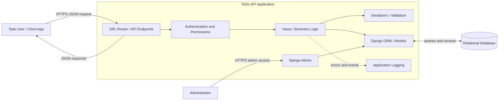
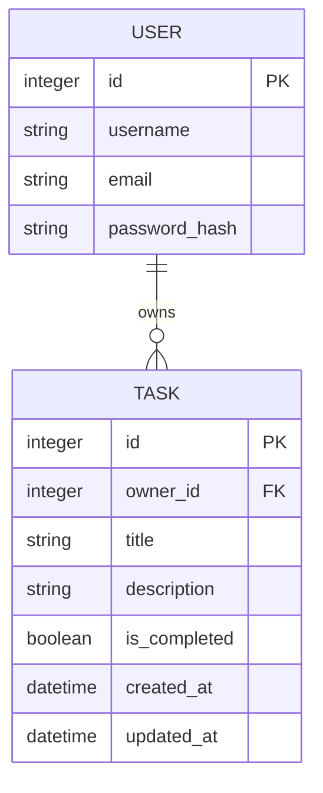
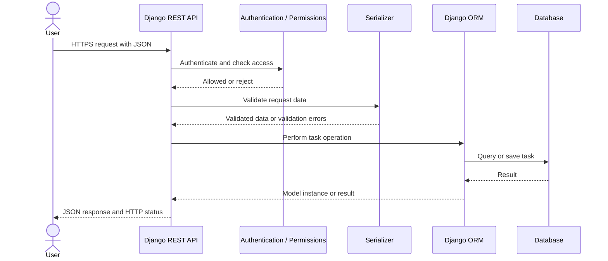
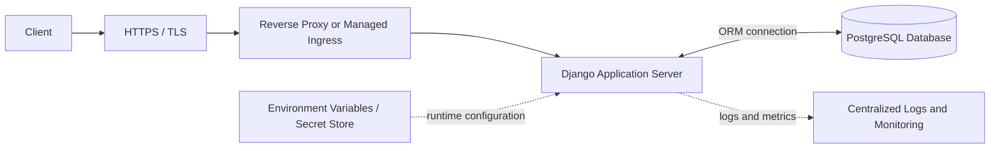
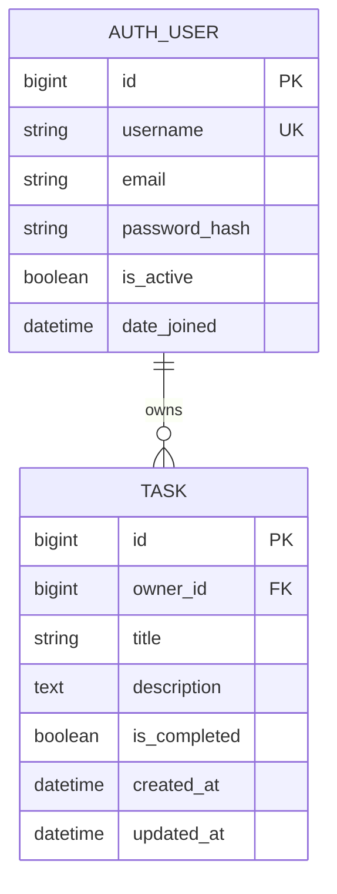

# ToDo API Application

A Django-based REST API for creating and managing to-do tasks.

> **Status:** The repository now contains a starter Django project, a `tasks` app, an authenticated task CRUD API, and SQLite migrations. Production hosting and JWT authentication remain design options, not implemented features.

## System Requirements

### Purpose

Provide an API through which people can organize tasks: create them, view them, update their details or completion status, and delete them.

### Users and Roles

- **Task user:** Manages their own tasks. When accounts are enabled, users must not see or modify another user's tasks.
- **Administrator:** Maintains the service and manages accounts or records through Django admin, if enabled.

### Functional Requirements

- Create, list, retrieve, update, complete, and delete tasks.
- Validate task data and return useful error responses for invalid requests.
- Associate every task with its owner and enforce ownership on task operations.
- Require authentication before users access task operations.

### Data Requirements

A task should include:

- Unique task ID
- Title
- Optional description
- Completion status
- Creation and last-updated timestamps
- Owner/user reference

User account credentials must be handled by Django's authentication system. Passwords must never be stored as plain text.

### Non-Functional Requirements

- Provide consistent JSON responses and HTTP status codes.
- Persist data in a relational database.
- Keep configuration and credentials out of source control.
- Use HTTPS in production, and configure logging and database backups for the deployment.

## System Design

### 1. Architecture Overview

The design uses a client-server model. A client sends JSON requests to a Django REST Framework API. The API authenticates and authorizes requests, validates input, applies application logic, and reads or writes task records through Django's ORM. A relational database stores the records.



### 2. Components and Responsibilities

| Component | Responsibility | Suggested technology |
|---|---|---|
| Client | Sends task requests and displays responses. | Browser, mobile app, or API client; JSON over HTTP |
| API routing | Maps URL paths and HTTP methods to handlers. | Django URL dispatcher, DRF routers |
| Authentication | Identifies the requester for protected task operations. | Django authentication; DRF authentication classes; JWT library such as Simple JWT if token authentication is selected |
| Permissions | Checks whether the requester may perform an operation and access a task. | DRF permissions and owner-filtered querysets |
| Views / business logic | Coordinates each operation and returns an HTTP response. | Django REST Framework views or viewsets |
| Serializers | Validates request data and converts model data to/from JSON. | DRF serializers |
| Data access | Reads and writes records through model abstractions. | Django models and ORM |
| Database | Persists tasks and user references. | SQLite for local development; PostgreSQL is a production option |
| Admin interface | Allows authorized staff to manage records. | Django Admin, if enabled |
| Logging | Records operational events and unexpected errors. | Python `logging` and the deployment platform's log service |
| Production server | Runs the Django application and handles incoming traffic. | Gunicorn or another supported WSGI/ASGI server; Nginx or managed platform as the front end |

### 3. Data Model

The following model assumes users have private task lists. If the application does not have user accounts, remove the `User` relationship and ownership rules.



**Relationship:** One user can own many tasks; each task belongs to one user. The database should enforce the owner relationship with a foreign key. Use Django's built-in user model or a project-defined custom user model rather than storing passwords yourself.

### 4. API Design

These are the current task routes registered by the DRF router.

| Method | Suggested path | Purpose | Typical success response |
|---|---|---|---|
| `POST` | `/api/v1/tasks/` | Create a task | `201 Created` with the new task |
| `GET` | `/api/v1/tasks/` | List the requester's tasks | `200 OK` with a task list |
| `GET` | `/api/v1/tasks/{id}/` | Retrieve one task | `200 OK` with the task |
| `PUT` | `/api/v1/tasks/{id}/` | Replace editable task fields | `200 OK` with the updated task |
| `PATCH` | `/api/v1/tasks/{id}/` | Partially update fields or completion status | `200 OK` with the updated task |
| `DELETE` | `/api/v1/tasks/{id}/` | Delete a task | `204 No Content` |
| — | Not implemented | No public registration endpoint is configured | — |
| — | Django authentication | Session and Basic authentication are enabled; no custom login/token API endpoint is configured | — |

For private tasks, list and detail queries must be restricted to the authenticated user. The API should not accept an owner ID from an untrusted client as proof of ownership; derive the owner from the authenticated request.

### 5. Request and Data Flow



1. The client sends an HTTPS request to an API endpoint.
2. The API checks authentication and permissions when required.
3. The serializer validates incoming data.
4. The view runs the requested task operation through the ORM.
5. The database returns or stores the task data.
6. The API returns JSON and an appropriate HTTP status code.

### 6. Security Design

- Require authentication for private task data.
- Check task ownership on every read, update, and delete operation.
- Validate input with serializers and enforce reasonable field limits.
- Use Django's password hashing and established authentication mechanisms.
- Use HTTPS/TLS in production.
- Store `SECRET_KEY`, database credentials, and token-signing secrets in environment configuration or a secret manager; never commit them to Git.
- Disable Django debug mode in production and restrict Django admin to authorized staff.
- Apply rate limiting to authentication endpoints where appropriate.
- Avoid returning credentials, tokens, stack traces, or internal configuration in error responses.

### 7. Errors and Failure Handling

| Situation | Suggested status | Handling |
|---|---:|---|
| Invalid or missing request fields | `400 Bad Request` | Return field-level validation messages. |
| Missing or invalid authentication | `401 Unauthorized` | Ask the client to authenticate. |
| Authenticated user lacks permission | `403 Forbidden` | Reject the operation. |
| Task does not exist or is not visible to this user | `404 Not Found` | Return a generic not-found response. |
| Unsupported HTTP method | `405 Method Not Allowed` | Identify that the method is not supported. |
| Temporary database or service failure | `500` or `503` | Return a generic message, log diagnostic details securely, and retry only when safe. |
| Unexpected application error | `500 Internal Server Error` | Do not expose stack traces; log enough detail for investigation. |

Responses should use a consistent JSON error structure, for example:

```json
{
  "error": {
    "code": "validation_error",
    "message": "The request contains invalid data.",
    "details": {
      "title": ["This field is required."]
    }
  }
}
```

### 8. Deployment View



For a production deployment, configure a supported Django application server, HTTPS termination, a production database, environment-specific settings, database backups, and centralized logs. SQLite is suitable for local development; choose the production database based on hosting and operational needs.

### 9. Design Concepts and Tools Summary

| Concept | Use in this application | Suggested tools |
|---|---|---|
| Client-server architecture | Separate the user interface from task processing and storage. | HTTP/HTTPS, JSON |
| REST | Use resource endpoints and standard HTTP methods. | Django REST Framework |
| Layered architecture | Separate routing, request handling, validation, and persistence. | Django URLs, DRF views, serializers, models |
| Relational data model | Link tasks to their owners and store structured records. | Django ORM, SQLite/PostgreSQL |
| Authentication and authorization | Identify users and enforce access rules. | Django auth, DRF permissions; Simple JWT if JWT is selected |
| Input validation | Reject malformed or incomplete task data. | DRF serializers, Django model validation |
| Secure configuration | Keep secrets out of source code. | Environment variables or a secret manager |
| Observability | Diagnose application and infrastructure failures. | Python logging and hosting-provider monitoring |
| Deployment | Serve the API in a production environment. | Gunicorn/ASGI server, Nginx or managed hosting |
| Diagram documentation | Keep diagrams readable in the GitHub README. | Mermaid; diagrams.net for manually drawn/exported diagrams |

## Implementation Status

The current code includes Django REST Framework, Django user accounts, authenticated per-user task ownership, Django admin, and task routes under `/api/v1/tasks/`. PostgreSQL, JWT authentication, registration endpoints, and production hosting remain proposed options.

## Detailed API Design

> This section records the current API behavior. Proposed extensions are identified separately.

### API Conventions

- Base path: `/api/v1/`
- Content type: `application/json`
- Authentication: require an authenticated user for task endpoints if tasks are private. Use Django session authentication for browser clients or token authentication for mobile/third-party clients; choose one and configure it consistently.
- Resource format: task objects use `id`, `title`, `description`, `is_completed`, `created_at`, and `updated_at`. The API derives `owner` from the authenticated user and does not accept it in task create/update requests.
- Dates: return timestamps in ISO 8601 format with timezone information.
- Unknown task IDs and tasks owned by another user should both return `404` so the API does not reveal another user's records.

### Endpoint Contract

| Method and path | Authentication | Purpose | Success status |
|---|---|---|---:|
| `POST /api/v1/tasks/` | Required | Create a task owned by the current user | `201 Created` |
| `GET /api/v1/tasks/` | Required | List the current user's tasks | `200 OK` |
| `GET /api/v1/tasks/{id}/` | Required | Retrieve one of the current user's tasks | `200 OK` |
| `PUT /api/v1/tasks/{id}/` | Required | Replace editable fields of a task | `200 OK` |
| `PATCH /api/v1/tasks/{id}/` | Required | Update one or more editable fields | `200 OK` |
| `DELETE /api/v1/tasks/{id}/` | Required | Delete a task | `204 No Content` |
| `POST /api/v1/auth/token/` | Public | Obtain an access token, if JWT authentication is selected | `200 OK` |
| `POST /api/v1/auth/token/refresh/` | Public with refresh token | Obtain a new access token, if JWT is selected | `200 OK` |

Registration is optional. If self-service registration is required, add `POST /api/v1/auth/register/`, validate unique account identifiers, and use Django's `create_user`/password hashing flow. Do not expose admin-only user management through public task endpoints.

### Task Object

Example response:

```json
{
  "id": 42,
  "title": "Submit project report",
  "description": "Review the final draft and submit it.",
  "is_completed": false,
  "created_at": "2026-10-07T09:30:00Z",
  "updated_at": "2026-10-07T09:30:00Z"
}
```

### Create Task

`POST /api/v1/tasks/`

Request:

```json
{
  "title": "Submit project report",
  "description": "Review the final draft and submit it."
}
```

The server sets `id`, `owner`, `is_completed` (default `false`), `created_at`, and `updated_at`. A successful response returns `201 Created`, the task object, and optionally a `Location` header pointing to `/api/v1/tasks/42/`.

### List and Filter Tasks

`GET /api/v1/tasks/?is_completed=false&search=report&ordering=-created_at&page=1&page_size=20`

Suggested query parameters:

- `is_completed`: filter by completion state (`true` or `false`).
- `search`: search title and description, if search is enabled.
- `ordering`: allow-listed fields such as `created_at`, `updated_at`, or `title`; prefix with `-` for descending order.
- `page` and `page_size`: pagination controls with a configured maximum page size.

Example paginated response:

```json
{
  "count": 1,
  "next": null,
  "previous": null,
  "results": [
    {
      "id": 42,
      "title": "Submit project report",
      "description": "Review the final draft and submit it.",
      "is_completed": false,
      "created_at": "2026-10-07T09:30:00Z",
      "updated_at": "2026-10-07T09:30:00Z"
    }
  ]
}
```

The queryset must be filtered to the current authenticated user before applying filters or pagination.

### Retrieve, Update, and Delete

- `GET /api/v1/tasks/42/` returns the task or `404 Not Found`.
- `PUT /api/v1/tasks/42/` requires all editable fields, such as `title` and `description`.
- `PATCH /api/v1/tasks/42/` accepts only the fields being changed, for example `{ "is_completed": true }`.
- `DELETE /api/v1/tasks/42/` returns `204 No Content` after deletion.

The server must not allow clients to change `id`, `owner`, `created_at`, or other server-managed fields.

### Validation Rules

- `title`: required on create; trim surrounding whitespace; reject an empty value; limit to 200 characters.
- `description`: optional; limit to a documented maximum (for example, 5,000 characters).
- `is_completed`: boolean only; default to `false` on creation.
- IDs: integer or UUID, consistently chosen by the model and URL converter.
- Query parameters: validate values and enforce maximum page size; reject or ignore unsupported ordering fields consistently.

### Error Contract

Use a stable JSON shape for expected API errors. Example validation response (`400 Bad Request`):

```json
{
  "error": {
    "code": "validation_error",
    "message": "The request contains invalid data.",
    "details": {
      "title": ["This field is required."]
    }
  }
}
```

Recommended status mapping:

| Status | Meaning | Example |
|---:|---|---|
| `400` | Invalid request | Missing title or invalid boolean |
| `401` | Authentication required or invalid | Missing/expired credentials |
| `403` | Authenticated but not permitted | Restricted administrative operation |
| `404` | Resource not found or not visible to this user | Unknown/other user's task |
| `405` | Method unsupported | `PATCH` on a read-only endpoint |
| `429` | Rate limit exceeded, if configured | Too many authentication attempts |
| `500` | Unexpected server failure | Unhandled application error |
| `503` | Service temporarily unavailable, when applicable | Database unavailable during maintenance |

Never return stack traces, SQL errors, password data, tokens, or secret configuration to clients. Log diagnostic context on the server while avoiding sensitive values.

## Detailed Database Design

> This is a proposed relational design for private per-user task lists. If the application intentionally supports anonymous/shared tasks, revise ownership and access rules before implementation.

### Entity Relationship



Use Django's configured user model (`settings.AUTH_USER_MODEL`) as the user entity. The field details for the user table are managed by Django and may differ depending on whether the project uses the default or a custom user model. Do not create a separate password table or store raw passwords.

### Task Table Specification

| Column | Suggested type | Required/default | Purpose and rules |
|---|---|---|---|
| `id` | Big integer primary key (or UUID, if chosen) | Required, generated | Stable task identifier. Choose one ID strategy before initial migrations. |
| `owner_id` | Foreign key to configured user table | Required | Task owner; set by the server from the authenticated request. |
| `title` | `varchar(200)` | Required | Non-empty after trimming whitespace. |
| `description` | `text` | Optional, blank allowed | Longer task notes; apply an API-level maximum length. |
| `is_completed` | Boolean | Required, default `false` | Whether the task is complete. |
| `created_at` | Timezone-aware datetime | Required, set on creation | Audit timestamp; clients cannot set it. |
| `updated_at` | Timezone-aware datetime | Required, updated on save | Last modification timestamp; clients cannot set it. |

### Relationships and Delete Behavior

- One user owns zero or more tasks; each task has exactly one owner.
- Use a foreign key to `settings.AUTH_USER_MODEL`.
- Recommended default: `on_delete=models.CASCADE`, so deleting a user deletes that user's tasks. If the product must retain tasks after account deletion, define a deliberate anonymization/retention policy instead.
- The API must scope task queries by owner, even though the database foreign key guarantees that an owner exists.

### Constraints and Indexes

- Primary key on `id`.
- Foreign key on `owner_id` with a database index.
- Add a composite index on `(owner, is_completed, created_at)` if the common list view filters by completion and sorts by creation date.
- Add an index on `(owner, updated_at)` only if queries commonly sort/filter by update time and measurements justify it.
- Do not make `title` unique: users may create multiple tasks with the same title.
- Enforce title length and non-empty validation at the API/model level. Add database constraints only when they are portable and consistent with the supported database.
- Keep indexes aligned with real query patterns; unnecessary indexes slow writes and consume storage.

Example Django model outline (adapt to the project and user model):

```python
from django.conf import settings
from django.db import models


class Task(models.Model):
    owner = models.ForeignKey(
        settings.AUTH_USER_MODEL,
        on_delete=models.CASCADE,
        related_name="tasks",
    )
    title = models.CharField(max_length=200)
    description = models.TextField(blank=True)
    is_completed = models.BooleanField(default=False)
    created_at = models.DateTimeField(auto_now_add=True)
    updated_at = models.DateTimeField(auto_now=True)

    class Meta:
        ordering = ["-created_at"]
        indexes = [
            models.Index(fields=["owner", "is_completed", "created_at"]),
        ]

    def __str__(self):
        return self.title
```

This is a design example, not implemented code. If anonymous tasks are intended, `owner` would need a different design, and the privacy model should be reconsidered.

### Data Integrity and Lifecycle

- Create and update records through Django models/ORM so validation and timestamps are consistently applied.
- Use Django migrations as the versioned source of database schema changes (`makemigrations` to generate, `migrate` to apply).
- Back up the production database on a defined schedule and test restore procedures.
- Define retention and deletion behavior before adding task history or soft deletion.
- If concurrent edits become important, consider an explicit version field or `updated_at` conflict check; it is not needed for the initial CRUD design.

### Database Configuration Guidance

- **Development:** SQLite is convenient for local setup and demos.
- **Production:** PostgreSQL is a suitable relational database for concurrent users and deployment environments.
- Configure database credentials via environment variables or a secret manager.
- Use `USE_TZ = True` and store/return timezone-aware timestamps.
- Do not commit local database files or production credentials to the repository.


## Step-by-Step: Run the Django Project and Task App

The following process creates the project from an empty folder and runs the initial task API. The starter code in this repository already includes these steps through the initial database migration.

### Step 1: Create a project folder and virtual environment

In PowerShell, open a terminal in the folder where you want the repository, then run:

```powershell
mkdir todo-api
cd todo-api
python -m venv .venv
.\.venv\Scripts\python.exe -m pip install --upgrade pip
```

Using the virtual environment's Python executable directly avoids needing to change PowerShell's script execution policy.

### Step 2: Install dependencies

Create `requirements.txt` with:

```text
Django>=5.2,<6.2
djangorestframework>=3.16,<3.19
```

Install them:

```powershell
.\.venv\Scripts\python.exe -m pip install -r requirements.txt
```

### Step 3: Create the Django project and task app

Run these commands from the repository root:

```powershell
.\.venv\Scripts\django-admin.exe startproject config .
.\.venv\Scripts\python.exe manage.py startapp tasks
```

`config` contains project settings and root URLs. `tasks` contains task-specific models, serializers, views, URLs, and migrations.

### Step 4: Register Django REST Framework and the app

Add both apps to `INSTALLED_APPS` in `config/settings.py`:

```python
INSTALLED_APPS = [
    # Django's built-in apps...
    "rest_framework",
    "tasks",
]
```

Add the starter API defaults to the same settings file. These defaults require sign-in and paginate results at 20 tasks per page:

```python
REST_FRAMEWORK = {
    "DEFAULT_PERMISSION_CLASSES": [
        "rest_framework.permissions.IsAuthenticated",
    ],
    "DEFAULT_AUTHENTICATION_CLASSES": [
        "rest_framework.authentication.SessionAuthentication",
        "rest_framework.authentication.BasicAuthentication",
    ],
    "DEFAULT_PAGINATION_CLASS": "rest_framework.pagination.PageNumberPagination",
    "PAGE_SIZE": 20,
}
```

Basic authentication is for local development and must only be used over HTTPS in production. A production client can use a token authentication method after one is configured.

### Step 5: Define the Task database model

In `tasks/models.py`, define a task owned by a Django user:

```python
from django.conf import settings
from django.db import models


class Task(models.Model):
    owner = models.ForeignKey(
        settings.AUTH_USER_MODEL,
        on_delete=models.CASCADE,
        related_name="tasks",
    )
    title = models.CharField(max_length=200)
    description = models.TextField(blank=True)
    is_completed = models.BooleanField(default=False)
    created_at = models.DateTimeField(auto_now_add=True)
    updated_at = models.DateTimeField(auto_now=True)

    class Meta:
        ordering = ["-created_at"]
        indexes = [models.Index(fields=["owner", "is_completed", "created_at"])]
```

The owner is linked to Django's configured user model. The API assigns the current user automatically; clients cannot choose another owner.

### Step 6: Add request and response validation

Create `tasks/serializers.py`:

```python
from rest_framework import serializers
from .models import Task


class TaskSerializer(serializers.ModelSerializer):
    class Meta:
        model = Task
        fields = ("id", "title", "description", "is_completed", "created_at", "updated_at")
        read_only_fields = ("id", "created_at", "updated_at")

    def validate_title(self, value):
        value = value.strip()
        if not value:
            raise serializers.ValidationError("Title cannot be blank.")
        return value
```

### Step 7: Add authenticated, owner-scoped CRUD views

In `tasks/views.py`:

```python
from rest_framework import viewsets
from rest_framework.permissions import IsAuthenticated
from .models import Task
from .serializers import TaskSerializer


class TaskViewSet(viewsets.ModelViewSet):
    serializer_class = TaskSerializer
    permission_classes = [IsAuthenticated]

    def get_queryset(self):
        return Task.objects.filter(owner=self.request.user)

    def perform_create(self, serializer):
        serializer.save(owner=self.request.user)
```

The queryset filter ensures users can only list or retrieve their own tasks. The same scoped queryset protects update and delete operations.

### Step 8: Register API URLs

Create `tasks/urls.py`:

```python
from rest_framework.routers import DefaultRouter
from .views import TaskViewSet

router = DefaultRouter()
router.register("tasks", TaskViewSet, basename="task")
urlpatterns = router.urls
```

Include it from `config/urls.py`:

```python
from django.contrib import admin
from django.urls import include, path

urlpatterns = [
    path("admin/", admin.site.urls),
    path("api/v1/", include("tasks.urls")),
]
```

### Step 9: Create and apply database migrations

```powershell
.\.venv\Scripts\python.exe manage.py makemigrations tasks
.\.venv\Scripts\python.exe manage.py migrate
```

Django creates the SQLite database locally and records schema changes in `tasks/migrations/`. Commit migration files; do not commit the local `db.sqlite3` file.

### Step 10: Create a user and start the server

```powershell
.\.venv\Scripts\python.exe manage.py createsuperuser
.\.venv\Scripts\python.exe manage.py runserver
```

The development server is available at `http://127.0.0.1:8000/`. Keep it for local development only; use a production server and HTTPS when deploying.

### Step 11: Send requests to the API

Use the superuser username and password created in the previous step. In a second PowerShell window, create a task:

```powershell
curl.exe -u YOUR_USERNAME:YOUR_PASSWORD -H "Content-Type: application/json" -d '{"title":"First task","description":"Try the API"}' http://127.0.0.1:8000/api/v1/tasks/
```

List tasks:

```powershell
curl.exe -u YOUR_USERNAME:YOUR_PASSWORD http://127.0.0.1:8000/api/v1/tasks/
```

The router also provides detail, update, partial-update, and delete operations at `/api/v1/tasks/{id}/` using `GET`, `PUT`, `PATCH`, and `DELETE`. For example, mark task 1 complete:

```powershell
curl.exe -u YOUR_USERNAME:YOUR_PASSWORD -X PATCH -H "Content-Type: application/json" -d '{"is_completed":true}' http://127.0.0.1:8000/api/v1/tasks/1/
```

### Step 12: Inspect tasks in Django Admin

The `Task` model is registered in `tasks/admin.py`. Open `http://127.0.0.1:8000/admin/` and sign in with the superuser credentials to manage task records.

### Files created for this starter

```text
config/                 Django project settings and root URLs
 tasks/                 Task app
   migrations/           Database migrations
   models.py             Task database model
   serializers.py        JSON validation and representation
   views.py              Authenticated CRUD API
   urls.py               Task API routes
manage.py                Django management entry point
requirements.txt         Python dependencies
.gitignore               Local database, environment, and cache exclusions
```

> The API currently uses Django session/basic authentication and SQLite from the project settings. Registration endpoints, JWT authentication, PostgreSQL configuration, automated tests, and production deployment are not included.

## Local Django Setup

The Django project and task app are already included. From the repository root on Windows, create a virtual environment, install dependencies, migrate the SQLite database, and start the server:

```powershell
py -m venv .venv
.\.venv\Scripts\Activate.ps1
python -m pip install --upgrade pip
python -m pip install -r requirements.txt
python manage.py migrate
python manage.py runserver
```

Do not rerun `django-admin startproject` or `startapp`; `config/`, `tasks/`, and `manage.py` already exist. Use `python manage.py createsuperuser` if you need a local account to sign in to the authenticated API or Django admin. The task API routes are under `/api/v1/tasks/`.

See [requirements.md](requirements.md) for complete setup steps, available API routes, and project notes. `requirements.txt` is the pip dependency file.


