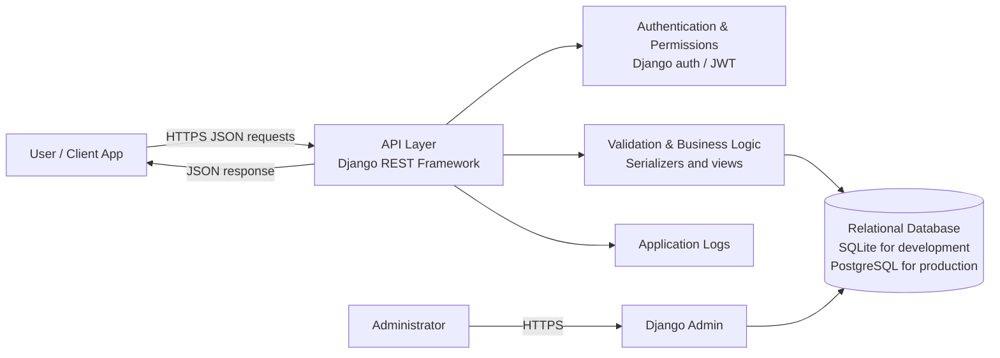

# ToDo API Application

A REST API for creating and managing to-do tasks, built with a Django backend.

## System Requirements

### 1. Purpose

The system provides an API for users to organize and track tasks. It supports creating, viewing, updating, completing, and deleting tasks.

### 2. Users and Roles

- **Task user:** Uses the API to manage tasks. If user accounts are enabled, each user can access only their own tasks.
- **Administrator:** Maintains the application and can manage records and accounts through Django admin, if configured.

### 3. Functional Requirements

- The system shall allow a user to create a task.
- The system shall allow a user to retrieve a list of tasks and the details of an individual task.
- The system shall allow a user to update task information and completion status.
- The system shall allow a user to delete a task.
- If authentication is enabled, the system shall associate tasks with their owner and restrict access accordingly.
- The system shall validate submitted task data and report invalid input clearly.

### 4. Data Requirements

The system shall store the following task information, as applicable:

- Task ID
- Title
- Description
- Completion status
- Creation timestamp
- Last-updated timestamp
- Owner/user reference, when accounts are enabled

If user accounts are supported, the system shall store account identifiers and securely managed authentication information. Passwords must not be stored as plain text; Django's password hashing should be used.

### 5. API Requirements

The API should provide endpoints for these operations. Actual URL paths and methods depend on the implementation.

| Operation | Typical HTTP method | Purpose |
|---|---|---|
| Create task | `POST` | Add a new task |
| List tasks | `GET` | Retrieve tasks available to the requester |
| Retrieve task | `GET` | Retrieve one task by ID |
| Update task | `PUT` or `PATCH` | Edit task fields or completion status |
| Delete task | `DELETE` | Remove a task |
| Register/login | `POST` | Authenticate users, if accounts are enabled |

### 6. Security Requirements

- The system shall validate and sanitize incoming data using Django/DRF serializers or equivalent validation.
- If tasks are private, the API shall require authentication and enforce ownership checks on every task operation.
- The system shall not expose credentials, secret keys, or detailed internal errors in API responses.
- Production deployments shall use HTTPS and keep secret keys and database credentials outside source control.
- Administrative access shall be restricted to authorized administrators.
- The system shall use appropriate permissions, HTTP methods, and status codes.

### 7. Error Handling and Failure Requirements

- Invalid or missing input shall return a clear client error, typically `400 Bad Request`.
- Requests without required authentication shall return `401 Unauthorized` or `403 Forbidden`, as appropriate.
- Requests for tasks that do not exist or are not accessible shall return `404 Not Found` (or the configured permission response).
- Unexpected server errors shall return a generic `500 Internal Server Error` response without exposing sensitive implementation details.
- Unexpected failures should be logged for diagnosis while protecting personal and authentication data.

### 8. Non-Functional Requirements

- The API shall return consistent JSON responses and HTTP status codes.
- The application shall persist task data in its configured database.
- The backend should be maintainable using Django's project and application structure.
- Production configuration should define appropriate database backups, logging, and deployment settings.

### 9. Assumptions and Implementation Notes

This document describes the intended system at a high level. Confirm that account registration, authentication, task ownership, Django admin, and the listed endpoints are implemented before treating them as existing features. Replace the typical API operations above with the actual routes in the project.

## System Design

### Architecture Diagram

The diagram shows a recommended baseline for the ToDo API. It is a logical design; confirm or update the components to match the actual deployment.

### Design Concepts and Tools

| System design concept | How it applies | Suitable tools / technologies |
|---|---|---|
| Client-server architecture | A web or mobile client sends requests to the backend API. | HTTP/HTTPS, JSON |
| REST API | Tasks are managed through resource-based endpoints and standard HTTP methods. | Django REST Framework (DRF) |
| Layered design | API views handle requests, serializers validate data, and models represent stored records. | Django, DRF serializers, Django ORM |
| Authentication and authorization | Confirms identity and limits users to permitted operations and their own tasks. | Django authentication and permissions; JWT library such as Simple JWT if token auth is needed |
| Relational data storage | Stores users and tasks, including ownership and timestamps. | SQLite for local development; PostgreSQL recommended for production |
| Input validation | Rejects missing, malformed, or invalid task data before saving. | DRF serializers and Django model validation |
| Error handling | Converts validation, missing-resource, and server failures into consistent HTTP responses. | DRF exceptions and custom exception handler, if needed |
| Security in transit | Protects API requests and credentials while they travel over the network. | HTTPS/TLS, typically configured at the deployment proxy or hosting platform |
| Configuration and secrets | Keeps environment-specific settings and credentials out of source code. | Environment variables; `django-environ` or `python-decouple` (optional) |
| Logging and monitoring | Captures errors and operational events for troubleshooting. | Python/Django logging; hosting provider monitoring (optional) |
| Deployment and reverse proxy | Serves the Django application reliably in production. | Gunicorn or Uvicorn as appropriate; Nginx or a managed hosting platform |

### Typical Request Flow

1. The client sends an HTTPS request containing JSON to a task endpoint.
2. Django REST Framework checks authentication and permissions, when enabled.
3. A serializer validates the request data.
4. The view applies the task operation through Django's ORM.
5. The configured database stores or retrieves the task.
6. The API returns a JSON response with an appropriate HTTP status code.

> **Note:** The tools above are recommendations for this design. The repository currently documents requirements only, so verify the actual installed packages, database configuration, authentication method, and deployment setup before describing them as implemented.
